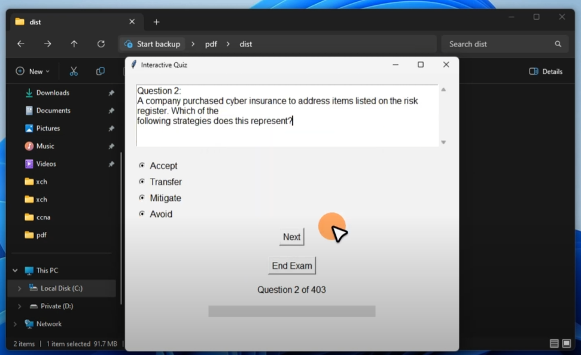

# PDF-Quizzer

# 📚 PDF-Quizzer  

## 📝 Description  
**PDF-Quizzer** is an interactive quiz application that extracts questions from a **PDF file** and presents them in a user-friendly **multiple-choice format**.  
It allows users to take a quiz and get instant results.  

---

## 🎯 Features  
- 📄 **Extracts questions & answers from a PDF**  
- 🏆 **Real-time scoring system**  
- 📊 **Progress tracking with a progress bar**  
- ⏩ **Skip to the next question easily**  
- 🛑 **End the quiz anytime and view results**  
- 🎨 **User-friendly interface with a scrollable view**  

---

🖥️ Usage
Launch the app
Select a PDF file containing questions
Answer the multiple-choice questions
Track your progress
Click "End Exam" to see your final score

## 🎥 Demo  
 

📌 Notes
Tested with: PassLeader PDF question files
Supports only multiple-choice question formats
Recommended PDF format: Properly structured MCQs

---

🤝 Contributing
Want to contribute? Fork this repository and submit a pull request!

📩 For suggestions, feel free to contact me.
